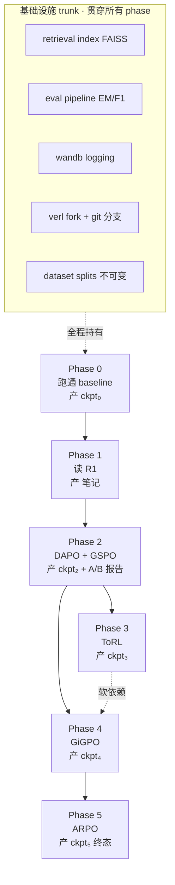

# 架构与阶段依赖

> **范围**：Phase 0–5 之间的依赖 DAG · trunk 共享产物 · 命名规范
> **来源**：master agent · `docs/architecture/{dependencies,trunk-artifacts}.md`
> **对应决策**：见姊妹篇《决策档案》§2 学习路径

---

## 1. 阶段依赖 DAG



## 2. 逐 Phase 输入 / 输出

| Phase | 硬依赖 | 主要产物 | 阻塞下游 |
|---|---|---|---|
| **0** baseline | 干净环境、Qwen2.5、Wikipedia 语料 | `ckpt₀`、retrieval index、eval pipeline | **全部下游** |
| **1** 读 R1 | `ckpt₀`（用于代码对照） | 注释源码、GRPO 笔记 | 阻塞 P2（认知前置） |
| **2** DAPO + GSPO | `ckpt₀` + P1 笔记 | `ckpt₂`、4 项 DAPO patch、GSPO patch、A/B 报告 | 阻塞 P3/P4/P5 算法基础 |
| **3** ToRL | `ckpt₂` | 改良 reward、可选多工具、`ckpt₃` | 软阻塞 P4 |
| **4** GiGPO | `ckpt₂` 或 `ckpt₃` | step-level advantage 代码、`ckpt₄` | 软阻塞 P5 |
| **5** ARPO | P4 步级框架 + 整链算法基础 | 熵驱动分支、`ckpt₅`(终) | — |

## 3. 软 vs 硬依赖

**硬依赖**（必须严格按序）：

- `P0 → P1`：没跑通就读源码会缺乏对照
- `P0 → P2`：没 baseline 就没改进的对比锚点
- `P1 → P2`：不懂 GRPO 改不动 DAPO

**软依赖**（顺序可调）：

- `P3 ↔ P4`：奖励层与算法层独立。建议先 P3，奖励变了之后 P4 的步级边界更清楚
- `P4 ↔ P5`：技术上可以直接做 ARPO，但 GiGPO 的步级框架是天然铺垫

**含义**：某阶段卡住时，**可临时跳到下一软依赖阶段**，不必死磕。

## 4. 三个并行机会

云 GPU 模式下时间被显著压缩：

1. **P0 训练时读 P1** — baseline 训 4–6h，期间读 DeepSeek-R1
2. **P2 读 DAPO 和 GSPO 可并行** — 两篇论文独立
3. **P3 / P4 论文阅读可前置 1–2 篇**

## 5. 失败回退矩阵

| 阶段失败 | 应对 |
|---|---|
| P0 失败 | **整体阻塞**，必须解决 |
| P2 没跑出更优结果 | **本身是有价值的负结果**，用 `ckpt₀` 继续 P3 |
| P4 步级 advantage 不收敛 | 回退 trajectory-level 继续 P5 |
| P5 失败 | 项目仍成功 — P0–P4 已覆盖 80% 学习目标 |

---

## 6. Trunk 共享产物（一旦建成全程不动）

> **绝对不要**每个 phase 重做。一旦 Phase 0 建成，所有后续 phase 共享。

| 产物 | 建立位置 | 后续策略 |
|---|---|---|
| Retrieval FAISS index | P0 | 只读，所有 phase 共享 |
| Eval pipeline (EM/F1 + dev sets) | P0 | 每 phase 跑同一套，结果直接可比 |
| wandb project | P0 | 每 phase 一个 group，run name 带 phase 标签 |
| Git 分支策略 | P0 | `phase0-baseline` → `phase2-dapo` / `phase2-gspo` 各自分支 |
| 数据集 split | P0 | **绝对不要**中途换 split，否则横跨 phase 不可比 |

## 7. wandb 命名规范

```
project: agentic-rl-search
group:   phase{0|2|3|4|5}-{algorithm}
name:    phase{N}-{algo}-{seed}-{timestamp}
tags:    [model:qwen2.5-3b, dataset:hotpotqa, ...]
```

例：

- `phase2-dapo-seed42-20260512`
- `phase2-gspo-seed42-20260513`

## 8. Git 分支策略

```
main                    # 始终是"已验证可跑"的状态
├── phase0-baseline     # baseline 复现
├── phase2-dapo         # 从 phase0 fork，加 DAPO 改进
├── phase2-gspo         # 从 phase0 fork，加 GSPO
├── phase3-torl         # 从 phase2 最佳分支 fork
├── phase4-gigpo        # 从 phase3 fork
└── phase5-arpo         # 从 phase4 fork
```

每个 phase 一个分支，便于 A/B、便于回退。

## 9. "金标准" dev set

| 数据集 | split | 用途 | 大小 |
|---|---|---|---|
| NQ | dev | 单跳基准 | ~3.6K |
| HotpotQA | dev | 多跳基准 | ~7.4K |
| 2WikiMultiHop | dev | 多跳泛化 | ~12K |
| Bamboogle | test | 难题压力测试 | ~125 |

**铁律**：这些 split 一旦定下来，整个项目周期不换。
