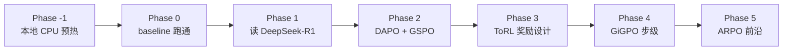

# agenicRL · Agentic RL 学习日志

通过一个**真实训练场景（Search-R1）**端到端学习 Agentic RL 的技术栈。
项目目标不是产出 SOTA，而是把每一篇论文 **变成一次具体的代码改动 + A/B 实验**。

## 项目地图

!!! info "一句话定位"
    Search-R1 = R1（推理算法）+ ToRL（工具范式）+ QA（最干净的 outcome reward）的交集场景。

## 关键约束

| 维度 | 取值 | 文档 |
|---|---|---|
| 场景 | Search-R1（多轮搜索 + QA） | [scenario](decisions/scenario.md) |
| 算力 | 4×A100（AutoDL 租用） | [compute](decisions/compute.md) |
| 基座 | Qwen2.5-3B-Instruct（全程不升 7B） | [compute](decisions/compute.md) |
| 节奏 | 晚间常规型，训练 run 原子化 | [compute](decisions/compute.md) |
| 论文路径 | 5 主干 + 2 增补 | [curriculum](decisions/curriculum.md) |

## 文档怎么读

1. 先看 [决策](decisions/scenario.md) 三篇——理解为什么这样选
2. 看 [架构](architecture/dependencies.md)——理解阶段间怎么衔接
3. 跟 [当前阶段](phase-minus-1/deliverables.md) 的清单做事
4. 进度和讨论沉淀在 [日志](journal/2026-04-26-kickoff.md)
